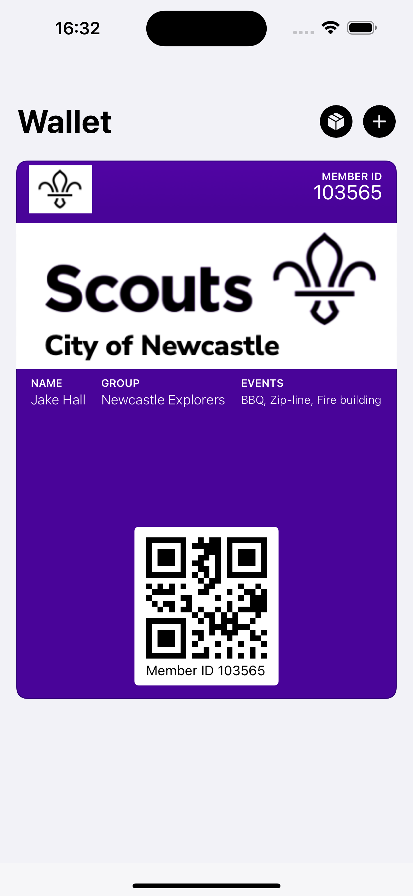

# pkpass-demo

This repo is a demo of generating a PKPASS file without the Apple signpass utility.

The process is fairly fiddly to get right, and there's a number of hidden requirements to make it all work together properly.

Here's an example of what this repo can produce.



## What is the PKPASS format?

Fundamentally a `pkpass` file is compressed `zip` folder, it has a few mandatory files and it contains a signature to prove it hasn't been tampered with, and was created by a legitimate source.

### Mandatory files

The PKPASS standard and the files required by an Apple iOS device are slightly different (depending on the pass type in use). Documented in this repo is the effective iOS standard, not the PKPASS standard.

Mandatory files (for a `storeCard` pass type)
* `pass.json`: a JSON file, describing the pass and how to display it.
* `manifest.json`: a generated file, containing SHA-1 hashes for all files in the pass (except itself and the signature file)
* `signature`: the PKCS#7 signature of the manifest file
* `icon.png`: for image usage see [Apple Developer documentation](https://developer.apple.com/library/archive/documentation/UserExperience/Conceptual/PassKit_PG/Creating.html)
* `logo.png`
* `strip.png`
* `thumbnail.png`

### Manifest file

The manifest file is a JSON dictonary containing a SHA-1 of each file contained in the PKPASS archive.

Example:
```
{
   "pass.json":"36213fe35e1559e94c577c32e5fcc93c37e1f335",
   "logo.png":"411896323ae07bfda1d0251188d3e2811acc3705",
   "icon.png":"411896323ae07bfda1d0251188d3e2811acc3705",
   "thumbnail.png":"411896323ae07bfda1d0251188d3e2811acc3705",
   "strip.png":"f7d196ac906ab3ee1a240085498f3f89fcd685a3"
}
```

Each file in this example has had it's SHA-1 computed, and added to the dictionary. The manifest itself is excluded, as is the signature.

### Signature

The signature is the most complex part of the puzzle. For a pkpass to successfully display in the iOS Wallet app, it has to match an Apple issued certificate.

We can use `openssl` cli to generate a valid signature, using the `smime` command.

Example:
```
openssl smime -sign -signer passcert.pem -inkey passkey.pem -certfile AppleG4.pem -in ./MemberID.pass/manifest.json -out ./MemberID.pass/signature -outform der -binary
```

You might be wondering where we can get `passcert.pem`, `passkey.pem`, `AppleG4.pem` files from...

## Apple Certificates

1. Create a new Pass Identifier in the Apple Developer console (https://developer.apple.com/account/resources/identifiers/list/passTypeId)
1. Get a certificate for it, follow instructions but leave the certificate name and common name blank
1. Import that certificate into Keychain Access (double click on it)
1. Check the certificate is trusted and valid (right click, get info) - it should say "This certificate is trusted".
1. If it's not valid, make a note of the "Organisational Unit" under "Issuer Name" it will be "G4" or similar. Also make a note of the "Organisational Unit" under "Subject Name" this is your `teamIdentifier`.
1. Download the associated certificate from Apple: https://www.apple.com/certificateauthority/ find the matching name from the previous step, in the intermediate certificates list.
1. You may also need some of the root Apple certificate if the intermediate is not trusted.
1. Export this `Apple Worldwide Developer Relations Certification Authority` as `pem` format. This is your `WWDR_FILENAME`
1. Export your pass ID certificate into a P12 format. You need to use the "Certificate" tab, and make sure it has a certificate and a private key attached (otherwise the following steps don't work)
1. Split the P12 file into 2 pem files: 
   * `openssl pkcs12 -in Certificates.p12 -clcerts -nokeys -out passcert.pem -legacy` (this is your `PASS_CERT_FILENAME`)
   * `openssl pkcs12 -in Certificates.p12 -nocerts -out passkey.pem -legacy` (this is your `PASS_KEY_FILENAME`)
1. Update the `passTypeIdentifier` and `teamIdentifier` in the `pass.json` file to match the one in your certificate.

## Generate a pkpass file

1. Run `python3 sign.py`
1. Open an Xcode Simulator running an iPhone
1. Drag the created `pass.pkpass` file onto the Simulator window, it should open the Wallet app and offer to add the pass automatically.
  * If not, check in the Console.app (Applications -> Utilities -> Console), for errors created by `passbook`

